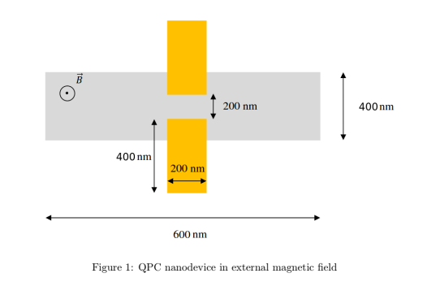

# Quantum point contact in the external magnetic field

The project focuses on the phenomenon where the confinement of electrons significantly influences the way they move in nanostructures. A notable example of this was first observed in a structure called 'Quantum Point Contact'. In this structure, electrons move through a very narrow path made by 'split gates'. In this structure, electrons move through a very narrow path made by 'split gates'. In this project, we will study how an external magnetic field changes the movement properties of the electrons in the device under consideration.

The code and a description of the issues can be found in the file QPC.ipynb.

## Technologies

* Numpy
* Kwant
* Matplotlib
* Scipy
* Ipywidgets

## Launch

The project was created using Jupyter Notebook.

## Project Status

The project is complete.

## Contact

Link to the LinkedIn profile

https://www.linkedin.com/in/klaudia-malon-898330305/